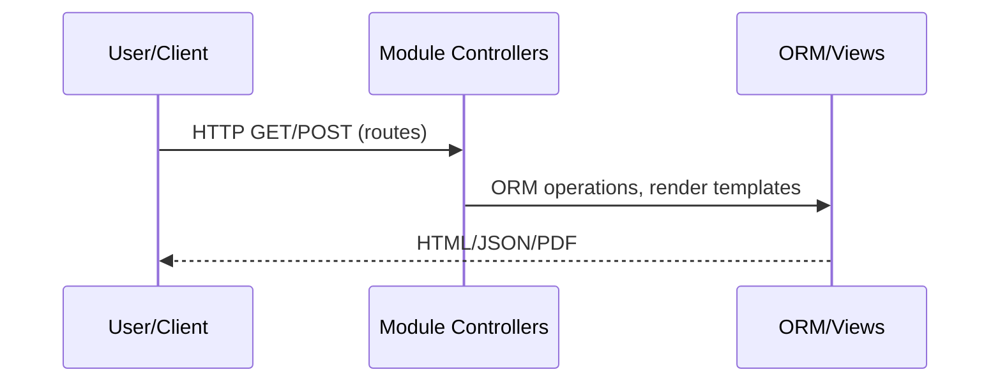

# Controllers

HTTP routes provided by this module.

```mermaid
sequenceDiagram
    participant U as User/Client
    participant C as Module Controllers
    participant O as ORM/Views

    U->>C: HTTP GET/POST (routes)
    C->>O: ORM operations, render templates
    O-->>U: HTML/JSON/PDF
```

Notes
- See files in controllers/ for route definitions.
